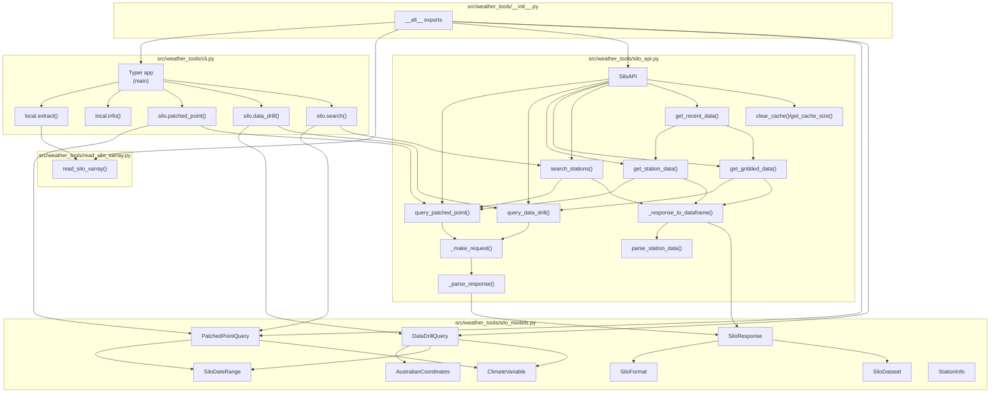

# Weather Tools

[](https://github.com/harryeslick/weather_tools/actions/workflows/mkdocs.yml)

Python tools for accessing and processing Australian SILO climate data.

**Features:**
- SILO API client with Pydantic validation
- Local NetCDF file support (xarray/pandas)
- Cloud-Optimized GeoTIFF (COG) support with spatial subsetting
- Command-line interface for data extraction and download
- Support for PatchedPoint (station) and DataDrill (gridded) datasets

## Installation

```bash
# Install from GitHub using uv
uv pip install git+https://github.com/harryeslick/weather_tools.git

# Or run directly without installation
uvx --from git+https://github.com/harryeslick/weather_tools.git weather-tools --help
```

## Usage

### SILO API

Set your API key (email address):

```bash
export SILO_API_KEY="your.email@example.com"
```

#### Command Line

```bash
# Query station data (PatchedPoint)
weather-tools silo patched-point --station 30043 \
    --start-date 20230101 --end-date 20230131 \
    --var R --var X --var N --output weather.csv

# Query gridded data (DataDrill)
weather-tools silo data-drill --latitude -27.5 --longitude 151.0 \
    --start-date 20230101 --end-date 20230131 \
    --var R --var X --output weather.csv

# Search for weather stations
weather-tools silo search --name Brisbane
weather-tools silo search --station 30043 --radius 50
```

#### Python API

```python
import os
from weather_tools.silo_api import SiloAPI
from weather_tools.silo_models import (
    PatchedPointQuery,
    DataDrillQuery,
    SiloDateRange,
    AustralianCoordinates,
    ClimateVariable,
    SiloFormat
)

# Initialize API client
api = SiloAPI(api_key=os.getenv("SILO_API_KEY"))

# Query station data
query = PatchedPointQuery(
    station_code="30043",
    format=SiloFormat.CSV,
    date_range=SiloDateRange(start_date="20230101", end_date="20230131"),
    values=[ClimateVariable.RAINFALL, ClimateVariable.MAX_TEMP]
)
response = api.query_patched_point(query)
print(response.raw_data)

# Query gridded data
query = DataDrillQuery(
    coordinates=AustralianCoordinates(latitude=-27.5, longitude=151.0),
    format=SiloFormat.CSV,
    date_range=SiloDateRange(start_date="20230101", end_date="20230131"),
    values=[ClimateVariable.RAINFALL]
)
response = api.query_data_drill(query)
print(response.raw_data)
```

### Local NetCDF Files

#### Downloading SILO Data


SILO's gridded datasets are hosted on Amazon Web Services under the [AWS Public Data Program](https://registry.opendata.aws).
The available data can be found here:  https://s3-ap-southeast-2.amazonaws.com/silo-open-data/Official/annual/index.html

Download SILO gridded NetCDF files directly from AWS S3 using the CLI:

```bash
# Download daily variables for recent years
weather-tools local download --var daily --start-year 2020 --end-year 2023

# Download specific variables
weather-tools local download --var daily_rain --var max_temp \
    --start-year 2022 --end-year 2023

# Download monthly rainfall (smaller files)
weather-tools local download --var monthly_rain \
    --start-year 2020 --end-year 2023

# Download to custom directory
weather-tools local download --var daily \
    --start-year 2020 --end-year 2023 \
    --silo-dir /data/silo_grids

# Force overwrite existing files
weather-tools local download --var daily_rain \
    --start-year 2023 --end-year 2023 --force
```

**Variable Presets:**
- `daily` - Daily rainfall, max/min temp, evaporation (4 variables, ~1.6GB/year)
- `monthly` - Monthly rainfall (1 variable, ~14MB/year)
- `temperature` - Max and min temperature (2 variables, ~820MB/year)

Or download manually from: https://s3-ap-southeast-2.amazonaws.com/silo-open-data/Official/annual/index.html

**Expected directory structure:**
```
~/Developer/DATA/silo_grids/
├── daily_rain/
│   ├── 2020.daily_rain.nc
│   └── 2021.daily_rain.nc
├── max_temp/
│   ├── 2020.max_temp.nc
│   └── 2021.max_temp.nc
└── min_temp/
    ├── 2020.min_temp.nc
    └── 2021.min_temp.nc
```

#### Working with Local Files

```bash
# View available data
weather-tools local info

# Extract data for a location
weather-tools local extract --lat -27.5 --lon 153.0 \
    --start-date 2020-01-01 --end-date 2020-12-31 \
    --output brisbane_2020.csv
```

#### Python API

```python
from weather_tools import read_silo_xarray

# Load daily variables
ds = read_silo_xarray(variables="daily")

# Extract data for a location
df = ds.sel(lat=-27.5, lon=153.0, method="nearest").sel(
    time=slice("2020-01-01", "2020-12-31")
).to_dataframe().reset_index()
```

### Cloud-Optimized GeoTIFF (COG) Files

SILO also provides daily and monthly data as Cloud-Optimized GeoTIFFs, which allow efficient partial reads without downloading entire files.

#### Downloading GeoTIFF Files

```bash
# Download entire daily GeoTIFFs
weather-tools geotiff download \
    --var daily_rain --var max_temp \
    --start-date 2023-01-01 --end-date 2023-01-31

# Download with spatial clipping using bounding box
weather-tools geotiff download \
    --var daily_rain \
    --start-date 2023-01-01 --end-date 2023-01-31 \
    --bbox 150.5 -28.5 154.0 -26.0

# Download with spatial clipping using geometry file
weather-tools geotiff download \
    --var daily_rain \
    --start-date 2023-01-01 --end-date 2023-01-31 \
    --geometry region.geojson \
    --output-dir ./data/geotiff
```

**Note**: GeoTIFF downloads use date format (YYYY-MM-DD), not years like NetCDF downloads.

#### Python API for Data Extraction

The Python API allows you to read GeoTIFF data directly from URLs without downloading, or extract data for specific locations:

```python
from weather_tools.silo_geotiff import read_geotiff_timeseries, read_cog
from shapely.geometry import Point, Polygon, box
from datetime import date

# Example 1: Extract timeseries for a Point (streaming, no disk caching)
point = Point(153.0, -27.5)  # Brisbane (lon, lat)
data = read_geotiff_timeseries(
    variables=["daily_rain", "max_temp"],
    start_date=date(2023, 1, 1),
    end_date=date(2023, 1, 31),
    geometry=point,
    save_to_disk=False  # Stream from URL
)
# Returns: {"daily_rain": array(31, h, w), "max_temp": array(31, h, w)}

# Example 2: Extract timeseries for a region (with disk caching)
bbox_geom = box(152.5, -28.0, 153.5, -27.0)  # Bounding box
data = read_geotiff_timeseries(
    variables="daily",  # Uses preset
    start_date=date(2023, 1, 1),
    end_date=date(2023, 1, 7),
    geometry=bbox_geom,
    save_to_disk=True,
    cache_dir=Path("./data/geotiff")
)

# Example 3: Read single COG file for a location
from weather_tools.silo_geotiff import construct_daily_url

url = construct_daily_url("daily_rain", date(2023, 1, 15))
data, profile = read_cog(url, geometry=point)
# data is masked numpy array, profile has georeferencing info
```

**GeoTIFF Benefits:**
- **Efficient partial reads**: Only download the data you need
- **Streaming support**: Work with data without storing locally
- **HTTP range requests**: COG features enable fast spatial queries
- **Overview pyramids**: Quickly preview data at reduced resolution

## Climate Variables

SILO provides 18 climate variables. Common codes:

**API Codes** (for `--var` option):
- `R` - Daily rainfall (mm)
- `X` - Maximum temperature (°C)
- `N` - Minimum temperature (°C)
- `V` - Vapour pressure (hPa)
- `E` - Evaporation (mm)
- `J` - Solar radiation (MJ/m²)
- `F` - FAO56 evapotranspiration (mm)

**Local NetCDF names** (for `--variables` option):
- `daily_rain`, `monthly_rain`
- `max_temp`, `min_temp`
- `evap_syn`, `evap_pan`
- `radiation`, `vp`

See [full documentation](https://harryeslick.github.io/weather_tools/) for complete variable list.

## CLI Reference

### SILO API Commands

```bash
weather-tools silo patched-point    # Query station-based data
weather-tools silo data-drill       # Query gridded data
weather-tools silo search           # Search/find stations
```

### Local NetCDF Commands

```bash
weather-tools local download        # Download SILO data from AWS S3
weather-tools local info            # View available data
weather-tools local extract         # Extract data from files
```

### GeoTIFF Commands

```bash
weather-tools geotiff download      # Download GeoTIFF files with optional spatial clipping
```

Run any command with `--help` for detailed options.

📖 **[Complete CLI Guide →](CLI_README.md)** - Comprehensive CLI documentation with examples

## Documentation

📚 [Full Documentation](https://harryeslick.github.io/weather_tools/)

- [SILO API Reference](https://harryeslick.github.io/weather_tools/silo_api/)
- [CLI Reference](https://harryeslick.github.io/weather_tools/cli/)
- [Python API](https://harryeslick.github.io/weather_tools/api_docs/read_silo/)
- [Examples](https://harryeslick.github.io/weather_tools/notebooks/example/)

## License

This project is licensed under the MIT License.

## Data License & Attribution

**SILO climate data** are provided under the [Creative Commons Attribution 4.0 International (CC BY 4.0)](https://creativecommons.org/licenses/by/4.0/) license.

**Data Provider:**  
SILO is managed by the Climate Projections and Services team within Queensland Treasury, Queensland Government.

**Data Sources:**  
SILO datasets are constructed from observational data obtained from the Australian Bureau of Meteorology (BoM) and other suppliers.

**Citation:**  
Jeffrey, S.J., Carter, J.O., Moodie, K.B. and Beswick, A.R. (2001). Using spatial interpolation to construct a comprehensive archive of Australian climate data. *Environmental Modelling & Software*, 16(4), 309-330.

**Website:**  
https://www.longpaddock.qld.gov.au/silo/

**Important Notes:**
- SILO uses mathematical interpolation to construct spatial grids and infill gaps in time series
- Users should understand the implications and accuracy of using interpolated data

## Acknowledgments

This software package is not affiliated with or endorsed by the Queensland Government, Queensland Treasury, or the Australian Bureau of Meteorology. It is an independent tool for accessing and processing publicly available SILO climate data.

We acknowledge the work of the SILO team in providing freely accessible, high-quality climate data for Australia.

## Module Relationships


