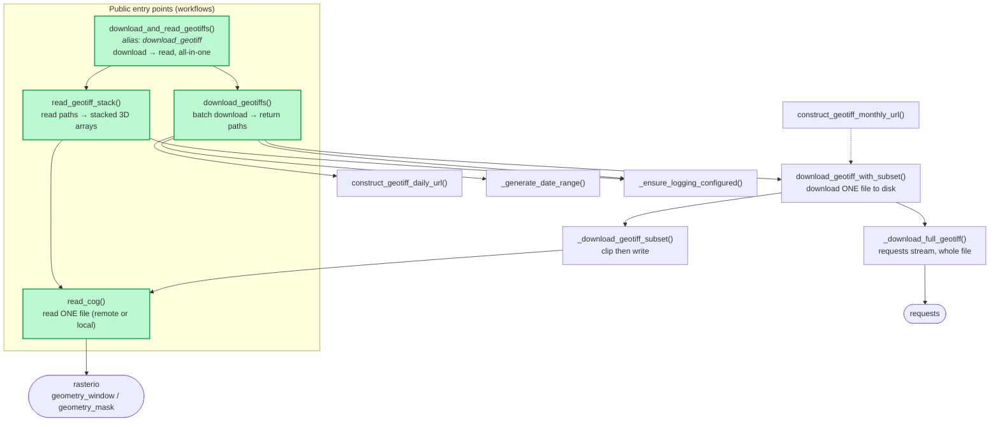

# `silo_geotiff.py` — Function Relationships & Workflows

## Call graph



## The three workflows

| Workflow | Entry point | Returns | When to use |
|---|---|---|---|
| **One-shot** | `download_and_read_geotiffs()` (`download_geotiff`) | arrays *or* paths | Quick path: "give me the data for this box and dates" |
| **Download only** | `download_geotiffs()` | `dict[var → list[Path]]` | Build a local cache; defer reading; share files |
| **Read existing** | `read_geotiff_stack()` | `dict[var → (3D array, profile)]` | Files already on disk; re-read without re-downloading |

The one-shot function is literally `download_geotiffs()` + `read_geotiff_stack()` glued together — so the lower two rows give you the same result with manual control over the boundary.

## `read_cog` vs the download path

These solve **different problems**, despite both touching the same S3 COG files.

### `read_cog(file_path, geometry, overview_level, use_mask)`
- **Reads pixels into memory.** Returns `(numpy array, profile)`. Writes nothing to disk.
- Works on **remote URLs** (`https://…`, via HTTP range requests), **`file://` URIs**, and **local paths** — same code path, because `rasterio.open` handles all three.
- This is the **only function that actually reads raster data.** Both `_download_geotiff_subset()` and `read_geotiff_stack()` call it.
- Leverages COG features: with a `geometry`, `geometry_window()` computes the pixel window so only the bytes covering your area-of-interest are fetched over the network — not the whole continent-sized file.

### `download_geotiff_with_subset(url, destination, …)`
- **Writes a file to disk.** Returns a `bool` (downloaded / skipped), not data.
- Picks one of two strategies:
  - **No geometry and no overview** → `_download_full_geotiff()`: a plain `requests` byte stream of the entire `.tif`.
  - **Geometry or overview given** → `_download_geotiff_subset()`: calls `read_cog()` to pull just the clipped/downsampled window, then `rasterio` writes that smaller raster to disk.

### Why two paths exist
```
read_cog            →  data in RAM        (streaming, ephemeral)
download_*_subset   →  smaller file on disk (clipped, reusable)
_download_full      →  full file on disk  (no clipping = no need to decode/re-encode)
```

- If you clip, you must **decode** the COG to know which pixels to keep — that's exactly what `read_cog` does, so the subset path reuses it.
- If you *don't* clip, decoding is wasted work; a raw byte-for-byte `requests` stream is faster and lossless, so `_download_full_geotiff` skips `read_cog` entirely.

### Rule of thumb
- **Just need the numbers right now, one location/box?** → `read_cog` (or `download_and_read_geotiffs(save_to_disk=False)`, which uses a temp cache).
- **Want files persisted for reuse / sharing / the CLI?** → the download path (`download_geotiffs` → `download_geotiff_with_subset`).

## Notes / smells worth knowing
- `download_geotiff` is an **alias for `download_and_read_geotiffs`**, *not* for `download_geotiff_with_subset`. The similar names are an easy trap.
- `construct_geotiff_monthly_url()` is public but **no orchestrator calls it** — the batch path is daily-only today (dashed edge above).
- The `404` handling is duplicated: once for `requests.HTTPError` (full download) and once for `RasterioIOError` string-matching (`read_cog` subset path), because the two strategies surface a missing file as different exception types.
